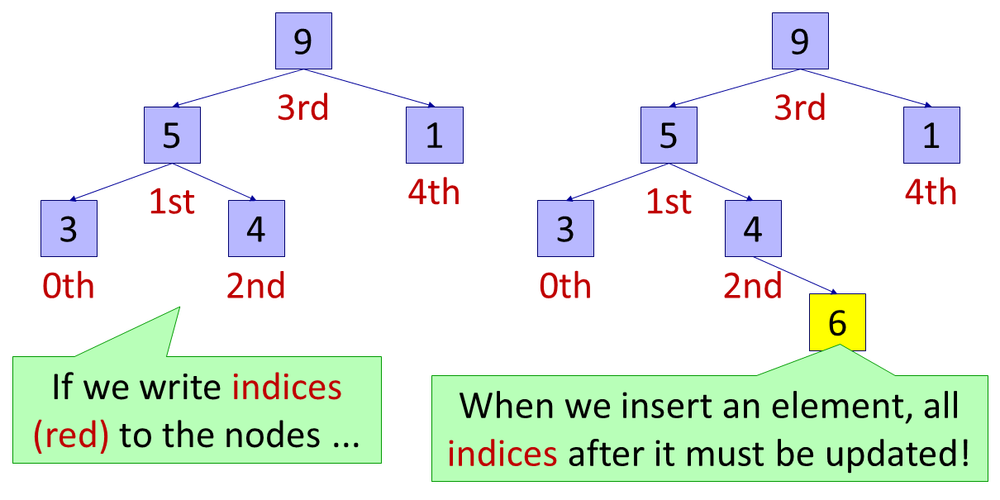
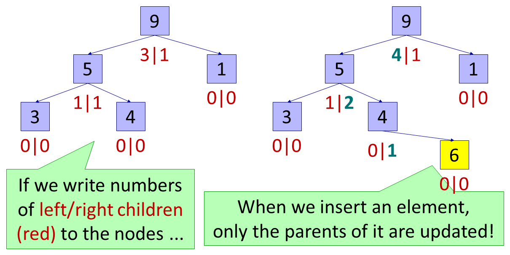

# LTOList

## Outline

LTOList (Logarithmic-Time-Operation List) is a linear list structure using a binary search tree. This is an implementation of LTOList in C++.

The variable-length array (VLA, `std::vector` in C++) and the linked list (LL, `std::list` in C++) are famous linear list structures, whose computational costs are: (n: the size of the list)
-   VLA: O(1) time (worst-case) for a random access, O(n) time (worst-case) for an insertion and a deletion,
-   LL: O(n) time (worst-case) for a random access, O(1) time (worst-case) for an insertion and a deletion.

The question is that how we achieve the middle; LTOList achieves O(log n) time for all of a random access, an insertion and a deletion in the worst case!

An LTOList is implemented with a binary search tree (BST) where the number of children is kept for each tree node. In the library a "red-black tree" is implemented from scratch.

### Tell me if you know ...

Such a data structure seems to be known to many others, but I could not find a specific name.
-   Example: [https://kaiseh.hatenadiary.org/entry/20071231/1199122020](https://kaiseh.hatenadiary.org/entry/20071231/1199122020); in Japanese, implemented by a "skip list" instead of BST

If you know a specific name, please tell me.

### Caveats

Since O(log n) time is achieved by tree operations (namely, pointer operations), in reality insertions and deletions may be slower than those for VLA that theoretically requires O(n) time but much more memory-efficient.

The implementation of LTOList is based on BST, but more memory-consuming than ordinary BST that orders elements automatically: ordinary BST requires three pointers for each list element, while LTOList requires five.

### Answers to anticipated questions

-   Why a "red-black tree" is implemented from scratch? Can it be implemented by C++-standard BST-based structures, for example, `std::map`?
    -   No. The "balancing", an essential operation of BST that assures the tree height being O(log n), of `std::map` is based on the "total order" of elements. LTOList must use a different order from the total order to balance the tree; This is why LTOList cannot be implemented by `std::map` or the like.

## Implementation details

How do we achieve O(log n) time for all of a random access, an insertion and a deletion in the worst case?

First suppose that, for each node in BST, we write the index of the element. However, when we insert or delete an element, the updates of the indices require O(n) time, as an insertion or deletion for VLA requires.

To avoid this situation, for each node in BST, we write the numbers of left and right children. Then, when we insert or delete an element, the updates of the numbers require only O(log n) time; it is sufficient to update the numbers for only the nodes from the inserted or deleted nodes to the root node.





## Usage

LTOTree has similar APIs to those of `std::vector`; almost all APIs are implemented except for memory allocations (e.g., `std::vector<T>::reserve`).

A large difference from `std::vector` is that, since LTOTree is implemented as a BST, given an iterator we can insert another element either before or after the iterator.

```
LTOList<double> ll;
LTOList<double>::iterator iter = ...;
ll.insert(iter, 3.5); // insert 3.5 before 'iter' (to be consistent with 'std::vector<T>::insert')
ll.insert(0, iter, 2.5); // insert 2.5 before 'iter'
ll.insert(1, iter, 4.5); // insert 4.5 after 'iter'
```

## Examples

You can build examples by the following command (example for `LTOList_example_poppush.cpp`, using GCC):

```
$ g++ LTOList_example_poppush.cpp
```

You can also create a `Makefile` that builds examples by [CMake](https://cmake.org/): if you have CMake, the following command will generate a `Makefile` for all examples:

```
$ cmake .

(if you are at the directory where CMakeLists.txt locates)
```

## Document

The document can be generated with [Doxygen](http://www.doxygen.nl/). (Not all APIs are documented yet.)

The generated document is also available at [https://hhiro.net/ltolist/doxygen/](https://hhiro.net/ltolist/doxygen/) .

## Author

H.Hiro

- e-mail: [main@hhiro.net](mailto:main@hhiro.net)
- Website: [https://hhiro.net/](https://hhiro.net/)
- GitHub: [https://github.com/maraigue](https://github.com/maraigue)

Published under the MIT license. See LICENSE.txt for details.
